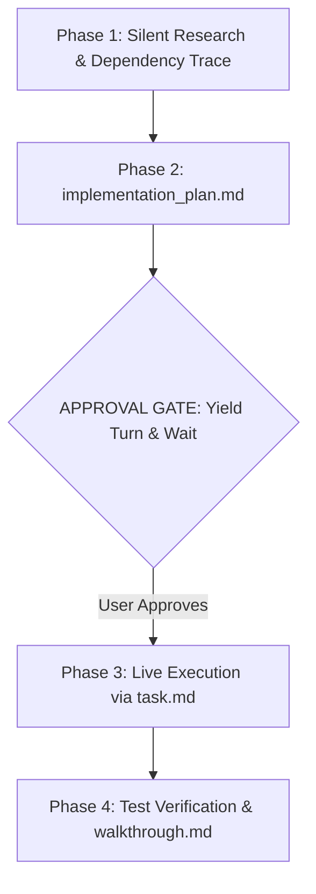

# 🚀 Antigravity Protocol for Claude (1-Click Suite)

> **Supercharge Claude Code and Claude Desktop with Google Antigravity discipline.** Save 70%+ tokens, eliminate conversational fluff, force visual Mermaid architecture diagrams, and mandate approval gates before editing code.

[](LICENSE)
[](#-1-click-installation)
[](https://docs.anthropic.com/en/docs/claude-code)
[](https://claude.ai)

---

## ⚡ The Problem vs The Antigravity Solution

| Standard Claude Experience ❌ | With Antigravity Protocol ✅ |
| :--- | :--- |
| **Conversational Fluff:** Starts with *"Sure, I'd be happy to help!"* and ends with *"Hope this helps!"*. | **Zero Fluff:** Immediate, raw, copy-paste-ready engineering outputs. |
| **Chat Stream Pollution:** Dumps 400 lines of messy code directly into your chat. | **Mandatory Artifacts:** Isolates plans, tasks, and walkthroughs in the side pane. |
| **Silent Breakages:** Modifies connected functions without warning or explanation. | **Ripple Impact Disclosure:** Explains what is there, what changes, and why before touching code. |
| **Monolithic Dumps:** Rewrites entire files for a 3-line change, exhausting tokens. | **Targeted Chunk Diffs:** Edits only the exact line ranges. |
| **Raw Code Blocks:** Outputs Mermaid syntax as unrendered text. | **Interactive Diagrams:** Mandates visual architecture diagrams with Mermaid and SVG. |

---

---

## 📦 1-Click Installation & Setup

### Windows (1-Click Setup)
1. Clone or download this repository:
   ```bash
   git clone https://github.com/moshidrafts/antigravity-claude.git
   ```
2. Double-click **`setup-antigravity-claude.bat`**.
3. **What happens automatically:**
   - Deploys all 10 skills to `~/.claude/skills/`.
   - Injects the global `CLAUDE.md` operating directive.
   - Automatically activates **1-Hour Prompt Caching** (`ENABLE_PROMPT_CACHING_1H=1`).
   - Copies Custom Instructions to your clipboard and prints the next steps clearly in your terminal!
4. Open **Claude Desktop** $\rightarrow$ **Settings** $\rightarrow$ **Custom Instructions** and press <kbd>Ctrl</kbd> + <kbd>V</kbd>.

### macOS & Linux (1-Line Command)
```bash
git clone https://github.com/moshidrafts/antigravity-claude.git && cd antigravity-claude && chmod +x install.sh && ./install.sh
```

---

## 🎛️ Interactive Settings Manager (`settings.bat` / `settings.sh`)

Don't want all skills running? Need to toggle prompt caching or install companion tools? 

Simply run **`settings.bat`** (Windows) or **`./settings.sh`** (macOS/Linux) to launch the live interactive terminal dashboard:

```text
==========================================================================
                 ANTIGRAVITY CONFIGURATION & SETTINGS                     
==========================================================================
 TOKEN OPTIMIZATIONS & COMPANIONS:
  [1] 1-Hour Prompt Caching           [ ENABLED  ]  (ENABLE_PROMPT_CACHING_1H)
  [2] RTK (Rust Token Killer)          [ ENABLED  ]  (Compresses noisy CLI output)
  [3] Graphify AST Codebase Graph     [ DISABLED ]  (Knowledge graph mapper)

 ------------------------------------------------------------------------
 BUNDLED SKILLS DIRECTORY:
  [ 4] antigravity                    [ ENABLED  ]
  [ 5] antigravity-planner            [ ENABLED  ]
  [ 6] frontend-design                [ ENABLED  ]
  [ 7] test-driven-development        [ ENABLED  ]
  [ 8] systematic-debugging           [ ENABLED  ]
  [ 9] verification-before-completion [ ENABLED  ]
  [10] web-artifacts-builder          [ ENABLED  ]
  [11] xlsx                           [ ENABLED  ]
  [12] pdf                            [ ENABLED  ]
  [13] docx                           [ ENABLED  ]

 ------------------------------------------------------------------------
 ACTIONS:
  [C] Copy Claude Desktop Instructions to Clipboard
  [U] Uninstall Antigravity Suite
  [0] Exit Settings
==========================================================================
```

- **Everything is ENABLED by default** for maximum power.
- Toggle any skill ON/OFF in real time (moves skills cleanly between `~/.claude/skills/` and `~/.claude/skills-disabled/`).
- State is saved persistently in `~/.claude/antigravity.json`.

---

## 🛠️ Bundled Skills Directory

All skills are installed directly into your `~/.claude/skills/` folder:

| Skill | Source | Purpose |
| :--- | :--- | :--- |
| **`antigravity`** | Antigravity Core | High-efficiency coding protocol, chunked editing, and token minimization. |
| **`antigravity-planner`** | Custom Suite | Mandates visual Mermaid architecture flowcharts, GFM alerts, and structured planning. |
| **`frontend-design`** | Official Anthropic | Eradicates "AI slop" (generic purple gradients, boring cards). Enforces boutique studio design. |
| **`test-driven-development`** | `obra/superpowers` | Enforces true red/green TDD (writes failing tests *before* writing code). |
| **`systematic-debugging`** | `obra/superpowers` | 4-phase root cause analysis before making code tweaks. |
| **`verification-before-completion`** | `obra/superpowers` | Enforces automated verification and tests before claiming task completion. |
| **`web-artifacts-builder`** | Official Anthropic | Bundles complex multi-component apps using **React 18 + Tailwind + shadcn/ui**. |
| **`xlsx`, `pdf`, `docx`** | Official Anthropic | Native manipulation of real Excel sheets, PDFs, and Word documents without corrupting formatting. |

---

## 💡 Automated Token-Saving Companions & Hacks

### 1. 1-Hour Prompt Caching (Automated)
Both `setup-antigravity-claude.bat` and `install.sh` automatically set `ENABLE_PROMPT_CACHING_1H=1`. Anthropic keeps your system prompts and repository context cached in memory for 1 hour, saving up to 90% on subsequent prompt tokens.

### 2. RTK (Rust Token Killer) Integration
[RTK](https://github.com/rtk-ai/rtk) is a high-speed CLI proxy that strips boilerplate and progress bar noise from bash tools (`git`, `cargo`, `pytest`, etc.), reducing token consumption by 60–90%.
- **1-Click Install:** Run `scripts/install-rtk.ps1` (or `./scripts/install-rtk.sh` on Unix), or select option `[2]` inside `settings.bat`.
- Automatically configures Claude Code hooks in `~/.claude/settings.json`.

### 3. Safe Uninstaller (`uninstall.bat` / `uninstall.sh`)
Need to revert? Double-click `uninstall.bat` or run `./uninstall.sh`. It safely cleans up all Antigravity skills, resets environment variables, and preserves any personal custom skills outside this suite.

---

## 🧠 The 4-Phase Artifact Lifecycle



---

## 🙏 Acknowledgements & Credits
- Inspired by the foundational token optimization work in [claude-token-optimizer](https://github.com/KINGSTAR-OMEGA/claude-token-optimizer) by [@KINGSTAR-OMEGA](https://github.com/KINGSTAR-OMEGA).
- Core software engineering skills derived from [superpowers](https://github.com/obra/superpowers) by [@obra](https://github.com/obra).
- Official design and document skills by [Anthropic](https://github.com/anthropics/skills).

---

## 📄 License
Released under the [MIT License](LICENSE).
