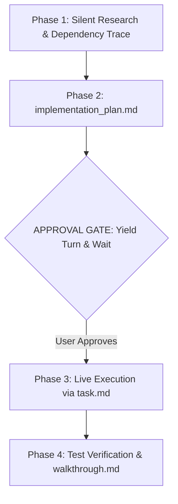

# 🚀 Antigravity Protocol for Claude (1-Click Suite)

> **Supercharge Claude Code and Claude Desktop with Google Antigravity discipline.** Save 70%+ tokens, eliminate conversational fluff, force visual Mermaid architecture diagrams, and mandate approval gates before editing code.

[](LICENSE)
[](#-1-click-installation)
[](https://docs.anthropic.com/en/docs/claude-code)
[](https://claude.ai)

---

## ⚡ The Problem vs The Antigravity Solution

| Standard Claude Experience ❌ | With Antigravity Protocol ✅ |
| :--- | :--- |
| **Conversational Fluff:** Starts with *"Sure, I'd be happy to help!"* and ends with *"Hope this helps!"*. | **Zero Fluff:** Immediate, raw, copy-paste-ready engineering outputs. |
| **Chat Stream Pollution:** Dumps 400 lines of messy code directly into your chat. | **Mandatory Artifacts:** Isolates plans, tasks, and walkthroughs in the side pane. |
| **Silent Breakages:** Modifies connected functions without warning or explanation. | **Ripple Impact Disclosure:** Explains what is there, what changes, and why before touching code. |
| **Monolithic Dumps:** Rewrites entire files for a 3-line change, exhausting tokens. | **Targeted Chunk Diffs:** Edits only the exact line ranges. |
| **Raw Code Blocks:** Outputs Mermaid syntax as unrendered text. | **Interactive Diagrams:** Mandates visual architecture diagrams with Mermaid and SVG. |

---

## 📦 1-Click Installation

### Windows (1-Click Double-Click)
1. Download or clone this repository:
   ```bash
   git clone https://github.com/moshidrafts/antigravity-claude.git
   ```
2. Double-click **`setup-antigravity-claude.bat`**.
3. **Done!** The script automatically deploys all skills to `~/.claude/` and **copies the Custom Instructions to your clipboard**.
4. Open **Claude Desktop** $\rightarrow$ **Settings** $\rightarrow$ **Custom Instructions** and press <kbd>Ctrl</kbd> + <kbd>V</kbd>.

### macOS & Linux (1-Line Terminal Command)
```bash
git clone https://github.com/moshidrafts/antigravity-claude.git && cd antigravity-claude && chmod +x install.sh && ./install.sh
```

---

## 🛠️ Bundled Skills Directory

All skills are installed directly into your `~/.claude/skills/` folder:

| Skill | Source | Purpose |
| :--- | :--- | :--- |
| **`antigravity`** | Antigravity Core | High-efficiency coding protocol, chunked editing, and token minimization. |
| **`antigravity-planner`** | Custom Suite | Mandates visual Mermaid architecture flowcharts, GFM alerts, and structured planning. |
| **`frontend-design`** | Official Anthropic | Eradicates "AI slop" (generic purple gradients, boring cards). Enforces boutique studio design. |
| **`test-driven-development`** | `obra/superpowers` | Enforces true red/green TDD (writes failing tests *before* writing code). |
| **`systematic-debugging`** | `obra/superpowers` | 4-phase root cause analysis before making code tweaks. |
| **`verification-before-completion`** | `obra/superpowers` | Enforces automated verification and tests before claiming task completion. |
| **`web-artifacts-builder`** | Official Anthropic | Bundles complex multi-component apps using **React 18 + Tailwind + shadcn/ui**. |
| **`xlsx`, `pdf`, `docx`** | Official Anthropic | Native manipulation of real Excel sheets, PDFs, and Word documents without corrupting formatting. |

---

## 💡 Pro Token-Saving Techniques & Hacks

Based on popular optimizations in the developer community:

### 1. Enable 1-Hour Prompt Caching
Anthropic supports 1-hour prompt caching for system prompts and repository contexts. Enable it in your environment:
- **Windows (PowerShell):**
  ```powershell
  [System.Environment]::SetEnvironmentVariable('ENABLE_PROMPT_CACHING_1H', '1', 'User')
  ```
- **macOS / Linux:**
  ```bash
  export ENABLE_PROMPT_CACHING_1H=1
  ```

### 2. Recommended Companion Tools
- **[RTK (Run-Time Kompactor)](https://github.com/rtk-ai/rtk):** Automatically filters and trims noisy bash command outputs (reducing token consumption by 60–90%).
- **[Headroom](https://github.com/headroomlabs-ai/headroom):** Compresses conversation history before API ingestion.
- **[Graphify](https://github.com/Graphify-Labs/graphify):** AST codebase graph mapping so Claude avoids repetitive file grepping.

### 3. Context Maintenance
- Use `/compact` every 20-30 turns to condense conversational memory.
- Use `/clear` between unrelated tasks.

---

## 🧠 The 4-Phase Artifact Lifecycle



---

## 🙏 Acknowledgements & Credits
- Inspired by the foundational token optimization work in [claude-token-optimizer](https://github.com/KINGSTAR-OMEGA/claude-token-optimizer) by [@KINGSTAR-OMEGA](https://github.com/KINGSTAR-OMEGA).
- Core software engineering skills derived from [superpowers](https://github.com/obra/superpowers) by [@obra](https://github.com/obra).
- Official design and document skills by [Anthropic](https://github.com/anthropics/skills).

---

## 📄 License
Released under the [MIT License](LICENSE).
