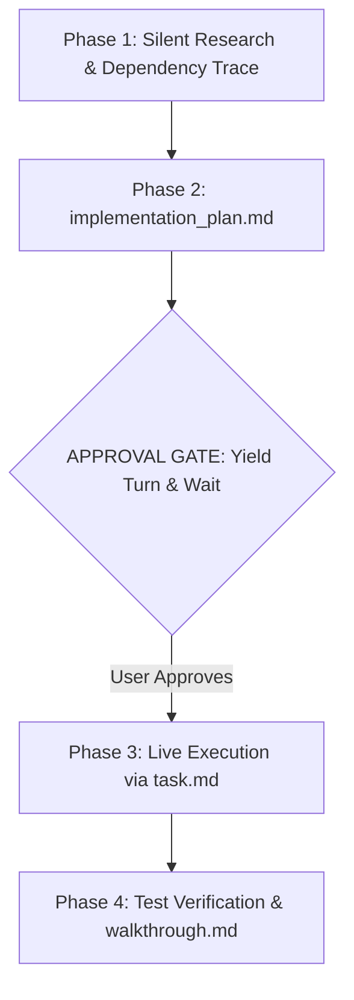

# 🚀 Antigravity Protocol for Claude (1-Click Suite)

> **Supercharge Claude Code and Claude Desktop with Google Antigravity discipline.** Save 70%+ tokens, eliminate conversational fluff, force visual Mermaid architecture diagrams, and mandate approval gates before editing code.

[](LICENSE)
[](#-1-click-installation)
[](https://docs.anthropic.com/en/docs/claude-code)
[](https://claude.ai)

---

## ⚡ The Problem vs The Antigravity Solution

| Standard Claude Experience ❌ | With Antigravity Protocol ✅ |
| :--- | :--- |
| **Conversational Fluff:** Starts with *"Sure, I'd be happy to help!"* and ends with *"Hope this helps!"*. | **Zero Fluff:** Immediate, raw, copy-paste-ready engineering outputs. |
| **Chat Stream Pollution:** Dumps 400 lines of messy code directly into your chat. | **Mandatory Artifacts:** Isolates plans, tasks, and walkthroughs in the side pane. |
| **Silent Breakages:** Modifies connected functions without warning or explanation. | **Ripple Impact Disclosure:** Explains what is there, what changes, and why before touching code. |
| **Monolithic Dumps:** Rewrites entire files for a 3-line change, exhausting tokens. | **Targeted Chunk Diffs:** Edits only the exact line ranges. |
| **Raw Code Blocks:** Outputs Mermaid syntax as unrendered text. | **Interactive Diagrams:** Mandates visual architecture diagrams with Mermaid and SVG. |

---

---

## 📦 1-Click Installation & Setup

### Windows (1-Click Setup)
1. Clone or download this repository:
   ```bash
   git clone https://github.com/moshidrafts/antigravity-claude.git
   ```
2. Double-click **`setup-antigravity-claude.bat`**.
3. **What happens automatically:**
   - Deploys all 11 skills to `~/.claude/skills/` and stores an offline copy in `~/.claude/skills-catalog/`.
   - Injects the global `CLAUDE.md` operating directive. *(If you already have an existing `CLAUDE.md`, the installer will ask whether to **[O]verwrite** with a `.bak` backup, **[A]ppend**, or **[C]ancel**!)*
   - Registers the global **`agy-settings`** CLI command in your PATH.
   - Automatically activates **1-Hour Prompt Caching** (`ENABLE_PROMPT_CACHING_1H=1`).
   - Copies Custom Instructions to your clipboard and prints next steps clearly in your terminal!
4. Open **Claude Desktop** $\rightarrow$ **Settings** $\rightarrow$ **Custom Instructions** and press <kbd>Ctrl</kbd> + <kbd>V</kbd>.

### macOS & Linux (1-Line Command)
```bash
git clone https://github.com/moshidrafts/antigravity-claude.git && cd antigravity-claude && chmod +x install.sh && ./install.sh
```

---

## 🎛️ Interactive Settings Manager (`agy-settings`)

Don't want all skills running? Need to toggle prompt caching or run system diagnostics?

Once installed, simply type **`agy-settings`** from **any terminal on your PC** (or run `settings.bat` in this folder) to open the interactive dashboard:

```text
==========================================================================
                 ANTIGRAVITY CONFIGURATION & SETTINGS                     
==========================================================================
 TOKEN OPTIMIZATIONS & COMPANIONS:
  [1] 1-Hour Prompt Caching           [ ENABLED  ]
      └─ Caches prompts & workspace in RAM for 1h (cuts 90% prompt cost)
  [2] RTK (Rust Token Killer)          [ ENABLED  ]
      └─ Strips CLI boilerplate/progress bars from git/npm/tests (60-90% savings)
  [3] Graphify AST Codebase Graph     [ DISABLED ]
      └─ Pre-maps codebase symbol relationships so Claude doesn't burn tokens grepping

 ------------------------------------------------------------------------
 BUNDLED SKILLS DIRECTORY:
  [ 4] antigravity                    [ ENABLED  ]
      └─ Core zero-fluff protocol & targeted chunk-diff rules
  [ 5] antigravity-planner            [ ENABLED  ]
      └─ Mandatory Mermaid architecture flowcharts & approval gates
  [ 6] caveman                        [ ENABLED  ]
      └─ JuliusBrussee: Ultra-compressed token communication (cuts 60-75% output tokens)
  [ 7] frontend-design                [ ENABLED  ]
      └─ Anthropic boutique visual design standards (anti-AI slop)
  [ 8] test-driven-development        [ ENABLED  ]
      └─ obra/superpowers: Enforces failing tests before writing code
  [ 9] systematic-debugging           [ ENABLED  ]
      └─ obra/superpowers: 4-phase root cause analysis before fixes
  [10] verification-before-completion [ ENABLED  ]
      └─ obra/superpowers: Requires automated test proof before claims
  [11] web-artifacts-builder          [ ENABLED  ]
      └─ Anthropic: React 18 + Tailwind + shadcn/ui multi-component apps
  [12] xlsx                           [ ENABLED  ]
      └─ Anthropic: Native Excel spreadsheet creation, formulas & data
  [13] pdf                            [ ENABLED  ]
      └─ Anthropic: PDF text/table extraction, page merging & OCR
  [14] docx                           [ ENABLED  ]
      └─ Anthropic: Word document formatting, styling & template generator

 ------------------------------------------------------------------------
 ACTIONS:
  [?] View In-Depth Feature Guide
  [T] Run System Diagnostics
  [C] Copy Claude Desktop Instructions to Clipboard
  [U] Uninstall Antigravity Suite
  [0] Exit Settings
==========================================================================
```

- **Everything is ENABLED by default** for maximum power.
- **1-Click Diagnostics `[T]`**: Instantly verifies that your Claude CLI, RTK proxy hook, prompt caching environment, and skills are active.
- **In-Depth Guide `[?]`**: Press `?` inside the menu to read an explanation of every feature without leaving the terminal.
- **Zero-Dependency Toggling**: Uses a self-contained `~/.claude/skills-catalog/`, so you can toggle skills anytime even if you delete the cloned repo folder.
- State is saved persistently in `~/.claude/antigravity.json`.

---

## 🛠️ Complete Feature & Skill Reference

Here is the complete breakdown of every optimization and skill in the suite, what it does, and when to toggle it:

### ⚡ Token Optimizations & Companion Tools

| Feature | Default | Purpose & Token Impact | When to Keep ON / When to Disable |
| :--- | :---: | :--- | :--- |
| **1-Hour Prompt Caching** | **ON** | Caches system prompt & repository context in server RAM for 1 hour. **Saves up to 90% on input tokens** for multi-turn sessions. | Keep **ON** permanently. Disable only if you are actively modifying system prompts and need cache busting on every turn. |
| **RTK (Rust Token Killer)** | **ON** | High-speed proxy that intercepts terminal command outputs (`git status`, `cargo test`, `pytest`, `npm`) and strips boilerplate, noise, and progress bars. **Cuts bash output tokens by 60–90%**. | Keep **ON** for all CLI workflows. Disable only if you need raw, uncompressed CLI logs for debugging obscure terminal errors. |
| **Graphify AST Graph** | **OPTIONAL** | Uses Tree-sitter to parse your codebase into an AST knowledge graph so Claude navigates symbols directly instead of grepping files. | Enable on large codebases (>50+ files) to avoid repetitive file searches. |

---

### 🧩 Bundled Skills Reference

All skills are installed directly into your `~/.claude/skills/` folder:

| Skill | Source | Purpose & Behavioral Impact |
| :--- | :--- | :--- |
| **`antigravity`** | Antigravity Core | Enforces zero conversational pleasantries, high-density formatting, and **targeted chunk-based edits** (never rewrites 300+ line files for a 3-line tweak). |
| **`antigravity-planner`** | Custom Suite | Mandates **interactive Mermaid architecture flowcharts**, ripple impact analysis, and hard approval gates before editing code. |
| **`caveman`** | `JuliusBrussee/caveman` | Ultra-compressed communication mode. Strips filler, hedging, and pleasantries while keeping exact technical terms and code. **Cuts output tokens by 60–75%**. |
| **`frontend-design`** | Official Anthropic | Eradicates "AI slop" (cliché purple gradients, generic bootstrap cards). Enforces distinctive palettes, intentional typography, and boutique studio aesthetics. |
| **`test-driven-development`** | `obra/superpowers` | Enforces true red/green TDD: Claude must write an automated test that reproduces the bug or tests the requirement, verify it fails, and only then write minimal passing code. |
| **`systematic-debugging`** | `obra/superpowers` | 4-phase root cause analysis (observe, hypothesize, isolate, verify). Stops random guessing and symptom-treating hacks. |
| **`verification-before-completion`** | `obra/superpowers` | Prohibits Claude from declaring work "complete" or claiming fixes work without executing concrete test/build verification commands first. |
| **`web-artifacts-builder`** | Official Anthropic | Complete development blueprint for multi-component **React 18 + Tailwind CSS + shadcn/ui** interactive applications. |
| **`xlsx`** | Official Anthropic | Real Excel workbook creation, formula computation, chart insertion, and tabular data cleansing without corrupting XML structures. |
| **`pdf`** | Official Anthropic | PDF text/table extraction, splitting/combining pages, rotating, decrypting, and OCR processing. |
| **`docx`** | Official Anthropic | Professional Microsoft Word document generation with custom typography, headings, tables of contents, and callout boxes. |

---

## 💡 Automated Token-Saving Companions & Hacks

### 1. 1-Hour Prompt Caching (Automated)
Both `setup-antigravity-claude.bat` and `install.sh` automatically set `ENABLE_PROMPT_CACHING_1H=1`. Anthropic keeps your system prompts and repository context cached in memory for 1 hour, saving up to 90% on subsequent prompt tokens.

### 2. RTK (Rust Token Killer) Integration
[RTK](https://github.com/rtk-ai/rtk) is a high-speed CLI proxy that strips boilerplate and progress bar noise from bash tools (`git`, `cargo`, `pytest`, etc.), reducing token consumption by 60–90%.
- **1-Click Install:** Run `scripts/install-rtk.ps1` (or `./scripts/install-rtk.sh` on Unix), or select option `[2]` inside `settings.bat`.
- Automatically configures Claude Code hooks in `~/.claude/settings.json`.

### 3. Complete Observability & Spend Intelligence Stack
Gain 100% visibility into token spend, cache efficiency, and waste across your sessions:
- **`session-metrics` (`@centminmod`)**: Real-time in-session cost and 9-category waste breakdown (*"how much has this session cost?"* or `/session-metrics`).
- **`session-report` (`@claude-plugins-official`)**: Self-contained interactive HTML analytics dashboard with cache-break heatmaps and subagent costs (`/session-report`).
- **`receipts` (`@claude-plugins-official`)**: Proof-of-work receipts correlating Claude Code sessions with git commits, projects, and CSV exports (`/receipts`).

### 4. Compiler-Grade Language Server Protocols (LSPs)
Eliminate brute-force file grepping and hallucinated imports:
- **`pyright-lsp`**: Instant Python type definitions, signatures, and compiler diagnostics.
- **`typescript-lsp`**: Direct TypeScript/JavaScript symbol navigation and compiler error detection.

### 5. Git & Review Workflow Automation
- **`commit-commands`**: Clean conventional git commits and branch cleanup (`/commit`, `/commit-push-pr`, `/clean_gone`).
- **`pr-review-toolkit`**: Multi-agent automated pull request review suite (`code-reviewer`, `silent-failure-hunter`, `type-design-analyzer`).

### 6. Safe Uninstaller (`uninstall.bat` / `uninstall.sh`)
Need to revert? Double-click `uninstall.bat` or run `./uninstall.sh`. It safely cleans up all Antigravity skills, resets environment variables, and preserves any personal custom skills outside this suite.

---

## 🧠 The 4-Phase Artifact Lifecycle



---

## 🙏 Acknowledgements & Credits
- Inspired by the foundational token optimization work in [claude-token-optimizer](https://github.com/KINGSTAR-OMEGA/claude-token-optimizer) by [@KINGSTAR-OMEGA](https://github.com/KINGSTAR-OMEGA).
- Ultra-compressed communication skill derived from [caveman](https://github.com/JuliusBrussee/caveman) by [@JuliusBrussee](https://github.com/JuliusBrussee).
- Token usage analyzer and marketplace infrastructure from [centminmod/claude-plugins](https://github.com/centminmod/claude-plugins) by [@centminmod](https://github.com/centminmod).
- Core software engineering skills derived from [superpowers](https://github.com/obra/superpowers) by [@obra](https://github.com/obra).
- Official design and document skills by [Anthropic](https://github.com/anthropics/skills).

---

## 📄 License
Released under the [MIT License](LICENSE).
