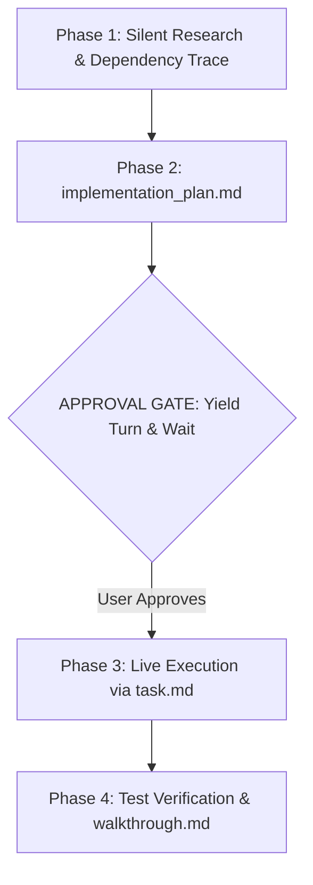

# 🚀 Antigravity Protocol for Claude (1-Click Setup)

> **Supercharge Claude with Google Antigravity discipline.** Save 70%+ tokens, kill conversational fluff, force visual Mermaid architecture diagrams, and mandate approval gates before editing code.

[](LICENSE)
[](#installation)
[](https://docs.anthropic.com/en/docs/claude-code)
[](https://claude.ai)

---

## ⚡ The Problem vs The Solution

| Standard Claude Experience ❌ | With Antigravity Protocol ✅ |
| :--- | :--- |
| **Conversational Fluff:** Starts with *"Sure, I'd be happy to help!"* and ends with *"Hope this helps!"*. | **Zero Fluff:** Immediate, raw, copy-paste-ready engineering outputs. |
| **Chat Stream Pollution:** Dumps 400 lines of messy code directly into your chat. | **Mandatory Artifacts:** Isolates plans, tasks, and walkthroughs in the right-side pane. |
| **Silent Breakages:** Modifies connected functions without warning or explanation. | **Ripple Impact Disclosure:** Explains what is there, what changes, and why before touching code. |
| **Monolithic Dumps:** Rewrites entire files for a 3-line change, exhausting tokens. | **Targeted Chunk Diffs:** Edits only the relevant line ranges. |
| **Raw Code Blocks:** Outputs Mermaid syntax as text instead of graphics. | **Interactive Diagrams:** Mandates visual architecture diagrams with Mermaid and SVG. |

---

## 📦 1-Click Installation

### Windows Users
1. Download or clone this repository.
2. Double-click **`setup-antigravity-claude.bat`**.
3. *Done!* The script automatically deploys the files and copies the Custom Instructions to your clipboard.
4. Open **Claude Desktop** $\rightarrow$ **Settings** $\rightarrow$ **Custom Instructions** and press <kbd>Ctrl</kbd> + <kbd>V</kbd>.

### macOS & Linux Users
Open your terminal and run:
```bash
chmod +x install.sh && ./install.sh
```
*(Or run directly via curl if hosted on GitHub):*
```bash
curl -fsSL https://raw.githubusercontent.com/YOUR_USERNAME/antigravity-claude/main/install.sh | bash
```

---

## 🧠 Core Engineering Principles Enforced

### 1. The 4-Phase Artifact Lifecycle
Every non-trivial engineering task follows Antigravity's structured phases:



### 2. The Ripple Impact Rule
If modifying feature A requires changing feature B, Claude is strictly forbidden from making silent edits. It must disclose:
- **What is currently there** (current behavior & snippet).
- **What it intends to change** (exact modifications).
- **Why / For what reason** (architectural necessity).

### 3. Visual Architecture Standards
- Mandatory Mermaid flowcharts (`graph TD`) or sequence diagrams (`sequenceDiagram`).
- Standard GitHub-Flavored Markdown alerts:
  > [!NOTE]
  > Architectural context or prerequisites.

  > [!IMPORTANT]
  > Critical sequence steps and non-negotiable requirements.

  > [!WARNING]
  > Breaking changes, performance bottlenecks, or potential bugs.

---

## 📂 Repository Structure

```text
├── setup-antigravity-claude.bat   # 1-Click Windows installer + clipboard injector
├── install.sh                     # 1-Click macOS/Linux installer
├── CLAUDE.md                      # Master global directive for Claude Code CLI
├── skills/
│   └── antigravity-planner/
│       └── SKILL.md               # Visual Mermaid planner skill
└── README.md                      # Documentation
```

---

## 📄 License
Released under the [MIT License](LICENSE).
