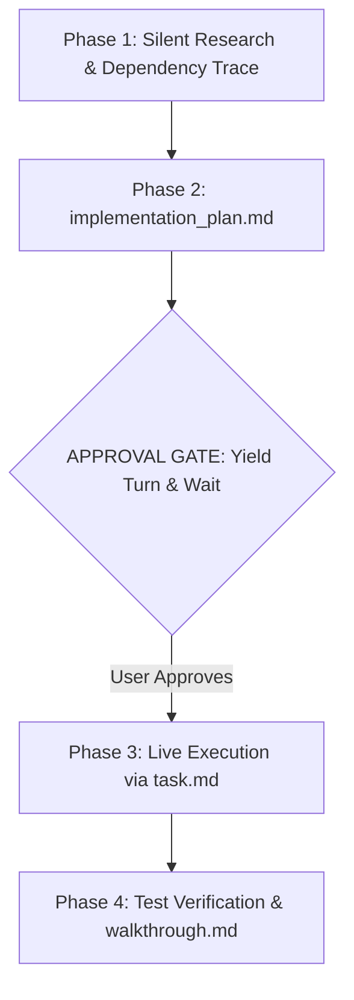

# 🚀 Antigravity Protocol for Claude Code (1-Click Suite)

> **Supercharge Claude Code and Claude Desktop with Google Antigravity discipline.** Save 70%+ tokens, eliminate conversational fluff, force visual Mermaid architecture diagrams, auto-map codebases with Graphify AST graphs, and mandate approval gates before editing code.

[](LICENSE)
[](#-1-click-installation)
[](https://docs.anthropic.com/en/docs/claude-code)
[](https://claude.ai)

---

## ⚡ The Problem vs The Antigravity Solution

| Standard Claude Experience ❌ | With Antigravity Protocol ✅ |
| :--- | :--- |
| **Conversational Fluff:** Starts with *"Sure, I'd be happy to help!"* and ends with *"Hope this helps!"*. | **Zero Fluff:** Immediate, raw, copy-paste-ready engineering outputs. |
| **Chat Stream Pollution:** Dumps 400 lines of messy code directly into your chat. | **Mandatory Artifacts:** Isolates plans, tasks, and walkthroughs in the side pane. |
| **Silent Breakages:** Modifies connected functions without warning or explanation. | **Ripple Impact Disclosure:** Explains what is there, what changes, and why before touching code. |
| **Monolithic Dumps:** Rewrites entire files for a 3-line change, exhausting tokens. | **Targeted Chunk Diffs:** Edits only the exact line ranges. |
| **Raw Code Blocks:** Outputs Mermaid syntax as unrendered text. | **Interactive Diagrams:** Mandates visual architecture diagrams with Mermaid and SVG. |
| **Blind Grepping:** Burns tokens reading files line-by-line across large repositories. | **AST Knowledge Graphs:** Pre-maps code symbols and relationships via Tree-sitter (`graphify`). |

---

## 📦 1-Click Installation & Setup

### Windows (1-Click Setup)
1. Clone or download this repository:
   ```bash
   git clone https://github.com/moshidrafts/antigravity-for-claude-code.git
   ```
   2. Double-click **`setup-antigravity-claude.bat`**.
3. **What happens automatically:**
   - Deploys all 12 skills to `~/.claude/skills/` and stores an offline copy in `~/.claude/skills-catalog/`.
   - Injects the global `CLAUDE.md` operating directive. *(If you already have an existing `CLAUDE.md`, the installer will ask whether to **[O]verwrite** with a `.bak` backup, **[A]ppend**, or **[C]ancel**!)*
   - Registers the global **`agy-settings`** CLI command in your PATH.
   - Automatically activates **1-Hour Prompt Caching** (`ENABLE_PROMPT_CACHING_1H=1`).
   - Automatically links **Graphify AST Graph** (`graphify.exe`) into your PATH if Python is present.
   - Copies Custom Instructions to your clipboard and prints next steps clearly in your terminal!
4. Open **Claude Desktop** $\rightarrow$ **Settings** $\rightarrow$ **Custom Instructions** and press <kbd>Ctrl</kbd> + <kbd>V</kbd>.

### macOS & Linux (1-Line Command)
```bash
git clone https://github.com/moshidrafts/antigravity-for-claude-code.git && cd antigravity-for-claude-code && chmod +x install.sh && ./install.sh
```

---

## 🎛️ Interactive Settings Manager (`agy-settings`)

Don't want all skills running? Need to toggle prompt caching or run system diagnostics?

Once installed, simply type **`agy-settings`** from **any terminal on your PC** (or run `settings.bat` in this folder) to open the interactive dashboard:

```text
==========================================================================
                 ANTIGRAVITY CONFIGURATION & SETTINGS                     
==========================================================================
 TOKEN OPTIMIZATIONS & COMPANIONS:
  [1] 1-Hour Prompt Caching           [ ENABLED  ]
      |-- Caches prompts & workspace in RAM for 1h (cuts 90% prompt cost)
  [2] RTK (Rust Token Killer)          [ ENABLED  ]
      |-- Strips CLI boilerplate/progress bars from git/npm/tests (60-90% savings)
  [3] Graphify AST Codebase Graph     [ ENABLED  ]
      |-- Pre-maps codebase symbol relationships so Claude doesn't burn tokens grepping

 ------------------------------------------------------------------------
 BUNDLED SKILLS DIRECTORY:
  [ 4] antigravity                    [ ENABLED  ]
      |-- Core zero-fluff protocol & targeted chunk-diff rules
  [ 5] antigravity-planner            [ ENABLED  ]
      |-- Mandatory Mermaid architecture flowcharts & approval gates
  [ 6] caveman                        [ ENABLED  ]
      |-- JuliusBrussee: Ultra-compressed token communication (cuts 60-75% output tokens)
  [ 7] frontend-design                [ ENABLED  ]
      |-- Anthropic boutique visual design standards (anti-AI slop)
  [ 8] test-driven-development        [ ENABLED  ]
      |-- obra/superpowers: Enforces failing tests before writing code
  [ 9] systematic-debugging           [ ENABLED  ]
      |-- obra/superpowers: 4-phase root cause analysis before fixes
  [10] verification-before-completion [ ENABLED  ]
      |-- obra/superpowers: Requires automated test proof before claims
  [11] web-artifacts-builder          [ ENABLED  ]
      |-- Anthropic: React 18 + Tailwind + shadcn/ui multi-component apps
  [12] xlsx                           [ ENABLED  ]
      |-- Anthropic: Native Excel spreadsheet creation, formulas & data
  [13] pdf                            [ ENABLED  ]
      |-- Anthropic: PDF text/table extraction, page merging & OCR
  [14] docx                           [ ENABLED  ]
      |-- Anthropic: Word document formatting, styling & template generator

 ------------------------------------------------------------------------
 ACTIONS:
  [?] View In-Depth Feature Guide
  [T] Run System Diagnostics
  [C] Copy Claude Desktop Instructions to Clipboard
  [U] Uninstall Antigravity Suite
  [0] Exit Settings
==========================================================================
```

- **Everything is ENABLED by default** for maximum power.
- **1-Click Diagnostics `[T]`**: Instantly verifies that your Claude CLI, RTK proxy hook, prompt caching environment, Graphify binary, and skills are active.
- **In-Depth Guide `[?]`**: Press `?` inside the menu to read an explanation of every feature without leaving the terminal.
- **Zero-Dependency Toggling**: Uses a self-contained `~/.claude/skills-catalog/`, so you can toggle skills anytime even if you delete the cloned repo folder.
- State is saved persistently in `~/.claude/antigravity.json`.

---

## 🛠️ Complete Feature & Skill Reference

Here is the complete breakdown of every optimization, companion tool, and bundled skill in the suite.

### ⚡ Token Optimizations & Companion Tools

| Feature | Default | Purpose & Token Impact | When to Keep ON / When to Disable |
| :--- | :---: | :--- | :--- |
| **1-Hour Prompt Caching** | **ON** | Caches system prompt & repository context in server RAM for 1 hour. **Saves up to 90% on input tokens** for multi-turn sessions. | Keep **ON** permanently. Disable only if you are actively modifying system prompts and need cache busting on every turn. |
| **RTK (Rust Token Killer)** | **ON** | High-speed proxy that intercepts terminal command outputs (`git status`, `cargo test`, `pytest`, `npm`) and strips boilerplate, noise, and progress bars. **Cuts bash output tokens by 60–90%**. | Keep **ON** for all CLI workflows. Disable only if you need raw, uncompressed CLI logs for debugging obscure terminal errors. |
| **Graphify AST Graph** | **ON** | Uses Tree-sitter to parse your codebase into an AST knowledge graph so Claude navigates symbols directly instead of grepping files. **Cuts exploration tokens up to 70x**. | Keep **ON** across all projects. Use `/graphify` in Claude Code to build or query your graph. |

---

### 🧩 The Antigravity Skills Interactive Showcase (12 Skills)

All 12 skills are installed directly into your `~/.claude/skills/` directory and are managed via `agy-settings`. 

> [!TIP]
> **Click any skill below to interactively expand its triggers, behavioral impact, before/after examples, and token savings!**

#### 🏗️ Domain 1: Architectural Control & Token Compression

<details>
<summary><b>1. <code>antigravity</code> — High-Density Engineering & Chunk Diffs</b> <i>(Always Active)</i></summary>
<br>

* **Trigger**: Automatic across all coding queries, or invoke via `@antigravity`.
* **The Problem It Solves**: Standard Claude rewrites entire 400-line files to change 2 lines, burning thousands of output tokens and introducing silent syntax regressions. It also writes conversational preambles (*"I understand you want to..."*).
* **Under The Hood**:
  1. **Zero Pleasantries**: Strictly bans conversational filler, pleasantries, and sign-offs.
  2. **Targeted Chunk Diffs**: Mandates surgical replacement chunks with exact start/end line anchors. Never dumps full files.
  3. **High-Density Formatting**: Enforces GFM alerts, tables, and concise code blocks.
* **Token Impact**: ⚡ **70–85% token reduction on code edits.**

```diff
// Standard Claude (Wastes 300+ tokens outputting unchanged code):
// [300 lines of existing file dumped into chat...]

// With Antigravity Protocol (Surgical chunk edit):
@@ -42,3 +42,3 @@
- const timeout = 5000;
+ const timeout = 15000;
```
</details>

<details>
<summary><b>2. <code>antigravity-planner</code> — Mermaid Visuals & Approval Gates</b> <i>(Always Active)</i></summary>
<br>

* **Trigger**: Multi-file refactors, new feature implementations, or complex bug fixes.
* **The Problem It Solves**: LLMs hallucinate dependencies, blindly modify functions without checking what touches them, and output raw unrendered Mermaid code blocks.
* **Under The Hood**:
  1. **Ripple Impact Check**: Discloses (1) What is currently there, (2) What intends to change, (3) Why.
  2. **Interactive Visual Architecture**: Forces Mermaid flowcharts and state diagrams to render in dedicated side pane artifacts.
  3. **HALT FOR APPROVAL (No Chaining)**: Claude yields its turn immediately after the Phase 1 plan artifact and **waits for your explicit approval** before touching a single line of code.
* **Reliability Impact**: 🛡️ **Zero runaway code generation; 100% architectural transparency.**
</details>

<details>
<summary><b>3. <code>caveman</code> — Ultra-Compressed Shorthand Mode</b> <i>(Trigger: <code>/caveman</code>)</i></summary>
<br>

* **Trigger**: `/caveman` (Supports `/caveman full`, `/caveman ultra`, `/caveman lite`, `/caveman stop`).
* **Source**: [JuliusBrussee/caveman](https://github.com/JuliusBrussee/caveman)
* **The Problem It Solves**: Claude spends hundreds of tokens on polite boilerplate, wordy disclaimers, and unnecessary commentary.
* **Under The Hood**: Speaks in ultra-compressed technical shorthand (like a caveman engineer). Preserves 100% of exact symbols, function signatures, paths, and bash commands, but strips all filler words and hedging.
* **Token Impact**: ⚡ **Slashes output tokens by 60–75%.**

| Standard Claude Response | With `/caveman` Mode |
| :--- | :--- |
| *"I have inspected your authentication module and it appears that on line 42, the token is not being verified properly against the secret key. To resolve this, you should update the verifyToken function..."* | `Auth module bug: line 42 token not verified with secret key. Fix verifyToken with jwt.verify(). Patch applied.` |
</details>

<details>
<summary><b>4. <code>graphify</code> — AST Codebase Knowledge Graph</b> <i>(Trigger: <code>/graphify</code>)</i></summary>
<br>

* **Trigger**: `/graphify .` (build graph) or `/graphify query "How does auth flow?"`.
* **Source**: [Graphify-Labs/graphify](https://github.com/Graphify-Labs/graphify)
* **The Problem It Solves**: Claude burns thousands of tokens blindly grepping files line-by-line across unfamiliar codebases.
* **Under The Hood**: Uses Tree-sitter to parse your codebase into an Abstract Syntax Tree (AST) knowledge graph of calls, imports, class hierarchies, and dependencies. Generates an interactive visual HTML graph.
* **Token Impact**: ⚡ **Cuts codebase exploration tokens up to 70x.**
</details>

---

#### 🛡️ Domain 2: Rigorous Engineering Verification

<details>
<summary><b>5. <code>test-driven-development</code> — True Red/Green TDD</b> <i>(Trigger: <code>/test-driven-development</code>)</i></summary>
<br>

* **Trigger**: Writing new features, bug fixes, or unit tests.
* **Source**: [obra/superpowers](https://github.com/obra/superpowers)
* **The Problem It Solves**: AI writes implementation code first, then writes confirmation-bias tests that test the implementation rather than the requirements (or mocks everything).
* **Under The Hood**:
  1. Write a failing automated test reproducing the issue.
  2. Execute the test and verify it fails with the exact expected failure mode.
  3. Write the minimal amount of code to make the test pass.
  4. Run tests to confirm green. Refactor.
* **Quality Impact**: 🧪 **True test coverage; zero hallucinated passing tests.**
</details>

<details>
<summary><b>6. <code>systematic-debugging</code> — 4-Phase Root Cause Isolation</b> <i>(Trigger: <code>/systematic-debugging</code>)</i></summary>
<br>

* **Trigger**: Investigating test failures, crashes, performance regressions, or mysterious bugs.
* **Source**: [obra/superpowers](https://github.com/obra/superpowers)
* **The Problem It Solves**: AI guesses random fixes, swaps lines around, and masks symptoms with try/catch wrappers.
* **Under The Hood**: Strict 4 phases:
  1. **Observe**: Gather concrete error traces and environment context.
  2. **Hypothesize**: Formulate falsifiable hypotheses.
  3. **Isolate**: Create the minimal reproducing test case.
  4. **Verify**: Prove the fix resolves the root cause without collateral regressions.
* **Quality Impact**: 🔍 **100% root-cause fixes; zero guess-and-check loops.**
</details>

<details>
<summary><b>7. <code>verification-before-completion</code> — Evidence-Based Sign-off</b> <i>(Always Active)</i></summary>
<br>

* **Trigger**: Finalizing any task, bug fix, or PR.
* **Source**: [obra/superpowers](https://github.com/obra/superpowers)
* **The Problem It Solves**: AI declaring *"All tests pass and the fix is complete!"* without ever executing test commands.
* **Under The Hood**: Strictly prohibits Claude from using completion words (*"complete"*, *"fixed"*, *"working"*) unless it executes a concrete verification command (`npm test`, `pytest`, `cargo test`, `tsc`) in the terminal and verifies exit code 0.
* **Quality Impact**: 🛡️ **Zero premature victory laps; rock-solid builds.**
</details>

---

#### 🎨 Domain 3: Visual Design & Rich Document Generation

<details>
<summary><b>8. <code>frontend-design</code> — Studio-Grade Aesthetic Standards</b> <i>(Trigger: <code>/frontend-design</code>)</i></summary>
<br>

* **Trigger**: Designing web UIs, dashboards, landing pages, or components.
* **Source**: Official Anthropic
* **The Problem It Solves**: "AI Slop" — cliché purple/indigo gradients, generic rounded cards, Roboto fonts, and cookie-cutter layouts.
* **Under The Hood**: Enforces distinctive typography pairings (serif editorial, high-contrast monospace, neo-grotesque), intentional cohesive palettes, micro-interactions, subtle borders, and boutique aesthetic direction.
* **Aesthetic Impact**: 🎨 **Bespoke, professional frontend design.**
</details>

<details>
<summary><b>9. <code>web-artifacts-builder</code> — Production React + Tailwind Blueprint</b> <i>(Trigger: <code>/web-artifacts-builder</code>)</i></summary>
<br>

* **Trigger**: Building interactive multi-component React applications.
* **Source**: Official Anthropic
* **The Problem It Solves**: Monolithic single-file React components with fragile state management and unstyled markup.
* **Under The Hood**: Production blueprint using **React 18 + Tailwind CSS + Lucide icons + shadcn/ui components** with proper state management and responsiveness.
* **Developer Impact**: ⚡ **Production-ready, copy-paste interactive web apps.**
</details>

<details>
<summary><b>10. <code>xlsx</code> — Corruption-Free Excel Engine</b> <i>(Trigger: <code>/xlsx</code>)</i></summary>
<br>

* **Trigger**: Creating, formatting, or updating Excel spreadsheets (`.xlsx`).
* **Source**: Official Anthropic
* **The Problem It Solves**: LLMs corrupting raw XML or generating broken formulas inside spreadsheet files.
* **Under The Hood**: Programmatic Python spreadsheet engine (`openpyxl`/`pandas`) ensuring valid formulas (`SUM`, `VLOOKUP`, `XLOOKUP`), conditional formatting, chart insertion, and strict XML schema validation.
</details>

<details>
<summary><b>11. <code>pdf</code> — Structural Extraction & OCR Engine</b> <i>(Trigger: <code>/pdf</code>)</i></summary>
<br>

* **Trigger**: Extracting text/tables, merging, splitting, rotating, or decrypting PDFs.
* **Source**: Official Anthropic
* **The Problem It Solves**: Regex text extractors that mangle tabular coordinates and multi-column magazine layouts.
* **Under The Hood**: Structural extraction pipeline that preserves bounding boxes, tabular column alignment, and OCR text recognition.
</details>

<details>
<summary><b>12. <code>docx</code> — Professional Word Document Generator</b> <i>(Trigger: <code>/docx</code>)</i></summary>
<br>

* **Trigger**: Generating formal documents, client proposals, contracts, or specs (`.docx`).
* **Source**: Official Anthropic
* **The Problem It Solves**: Unformatted raw text dumped into a blank Word doc.
* **Under The Hood**: Formats Word documents with custom typography hierarchies, automated tables of contents, callout boxes, headers/footers, and corporate styling standards.
</details>

---

### ⚡ Vetted Developer Plugins & Compiler LSPs (10 Tools)

Unlike third-party plugin packs that inject thousands of always-on tokens into every prompt and spam your slash (`/`) autocomplete menu with noisy colon-prefixed commands, the suite automatically provisions 10 vetted, clean developer tools:

<details>
<summary><b>Click to view the 10 Vetted Developer Plugins & LSPs</b></summary>
<br>

| Plugin | Purpose & Command | Overhead |
| :--- | :--- | :---: |
| **`pyright-lsp`** | Compiler-grade Python type definitions, signatures, and syntax errors. | **0 tokens** (LSP) |
| **`typescript-lsp`** | Instant TypeScript/JavaScript symbol navigation and compiler error detection. | **0 tokens** (LSP) |
| **`code-review`** | Audits uncommitted changes or branch PRs against best practices via `/code-review`. | Minimal |
| **`code-simplifier`** | Refactoring agent that eliminates over-engineering, dead abstractions, and bloat. | Minimal |
| **`commit-commands`** | Conventional git commits and branch cleanup via `/commit`, `/commit-push-pr`, `/clean_gone`. | Minimal |
| **`skill-creator`** | Anthropic's official test and benchmarking harness for authoring custom skills. | Minimal |
| **`claude-security`** | Official security auditor: scans codebases for vulnerabilities and generates patches. | Minimal |
| **`mcp-server-dev`** | Scaffolding, resource schemas, and tool design patterns for Model Context Protocol servers. | Minimal |
| **`mcp-tunnels`** | Secure Docker MCP tunneling utility via `/create-docker-mcp-tunnel`. | Minimal |
| **`agent-sdk-dev`** | Verification tools and app generator via `/new-sdk-app` for Anthropic Agent SDK. | Minimal |
</details>

---

### 🎬 Programmatic Video Generation Suite (12 Remotion Skills)

If you create programmatic videos, motion graphics, automated TikTok/Reels, or video ads in React:

<details>
<summary><b>Click to view the 12 Remotion Video Skills (in <code>~/.agents/skills/</code>)</b></summary>
<br>

All 12 Remotion skills are preserved in `~/.agents/skills/` and linked via junctions into your environment:
- **`remotion-create`**: Scaffolding new Remotion projects, compositions, and sequences.
- **`remotion-captions`**: Animated subtitles, SRT parsing, word-level highlight timing.
- **`remotion-docs`**: Official API guidelines, hooks (`useCurrentFrame`, `useVideoConfig`), and animation timing (`spring`, `interpolate`).
- **`remotion-interactivity`**: Player embedding, user controls, and interactive canvas overlays.
- **`remotion-render`**: Headless CLI rendering, AWS Lambda distributed rendering, and Docker ffmpeg configs.
- **`remotion-studio`**: Preview server setup, timeline navigation, and live reload optimizations.
- **`remotion-best-practices`**, **`remotion-maps`**, **`remotion-markup`**, **`remotion-multimedia`**, **`remotion-saas`**, **`remotion-upgrade`**.

> **Pro-Tip**: You can also link them at the project level (`<video-repo>/.claude/skills/`) so your global everyday coding menu stays minimal!
</details>

---

## 💡 Automated Token-Saving Companions & Hacks

### 1. 1-Hour Prompt Caching (Automated)
Both `setup-antigravity-claude.bat` and `install.sh` automatically set `ENABLE_PROMPT_CACHING_1H=1`. Anthropic keeps your system prompts and repository context cached in memory for 1 hour, saving up to 90% on subsequent prompt tokens.

### 2. RTK (Rust Token Killer) Integration
[RTK](https://github.com/rtk-ai/rtk) is a high-speed CLI proxy that strips boilerplate and progress bar noise from bash tools (`git`, `cargo`, `pytest`, etc.), reducing token consumption by 60–90%.
- **1-Click Install:** Run `scripts/install-rtk.ps1` (or `./scripts/install-rtk.sh` on Unix), or select option `[2]` inside `settings.bat`.
- Automatically configures Claude Code hooks in `~/.claude/settings.json`.

### 3. Graphify AST Codebase Knowledge Graph
[Graphify](https://github.com/Graphify-Labs/graphify) parses codebases into Tree-sitter AST relationships (call graphs, imports, class hierarchies) so Claude queries symbols directly:
- **CLI Commands**:
  - `/graphify .` : Extracts AST graph and generates interactive HTML architecture visualizer.
  - `/graphify query "How does auth flow?"` : Traverses the graph to answer questions without burning tokens grepping.
- Automatically managed and toggled via `agy-settings`.

### 4. Zero-Bloat Architecture & Clean Tooling
Unlike third-party plugin packs that inject thousands of always-on tokens into every prompt and spam your slash (`/`) autocomplete menu with dozens of noisy colon-prefixed commands:
- **Clean `/` Command Palette**: Only the pristine native skills and clean commands exist in your menu.
- **Silent Compiler LSPs**: Automatically provisions `pyright-lsp` and `typescript-lsp` for zero-token compiler accuracy.

### 5. Safe Uninstaller (`uninstall.bat` / `uninstall.sh`)
Need to revert? Double-click `uninstall.bat` or run `./uninstall.sh`. It safely cleans up all Antigravity skills, resets environment variables, and preserves any personal custom skills outside this suite.

---

## 🧠 The 4-Phase Artifact Lifecycle



---

## 🙏 Acknowledgements & Credits
- Inspired by the foundational token optimization work in [claude-token-optimizer](https://github.com/KINGSTAR-OMEGA/claude-token-optimizer) by [@KINGSTAR-OMEGA](https://github.com/KINGSTAR-OMEGA).
- Ultra-compressed communication skill derived from [caveman](https://github.com/JuliusBrussee/caveman) by [@JuliusBrussee](https://github.com/JuliusBrussee).
- AST Knowledge Graph engine derived from [graphify](https://github.com/Graphify-Labs/graphify) by [@Graphify-Labs](https://github.com/Graphify-Labs).
- Token usage analyzer and marketplace infrastructure from [centminmod/claude-plugins](https://github.com/centminmod/claude-plugins) by [@centminmod](https://github.com/centminmod).
- Core software engineering skills derived from [superpowers](https://github.com/obra/superpowers) by [@obra](https://github.com/obra).
- Official design and document skills by [Anthropic](https://github.com/anthropics/skills).

---

## 📄 License
Released under the [MIT License](LICENSE).
