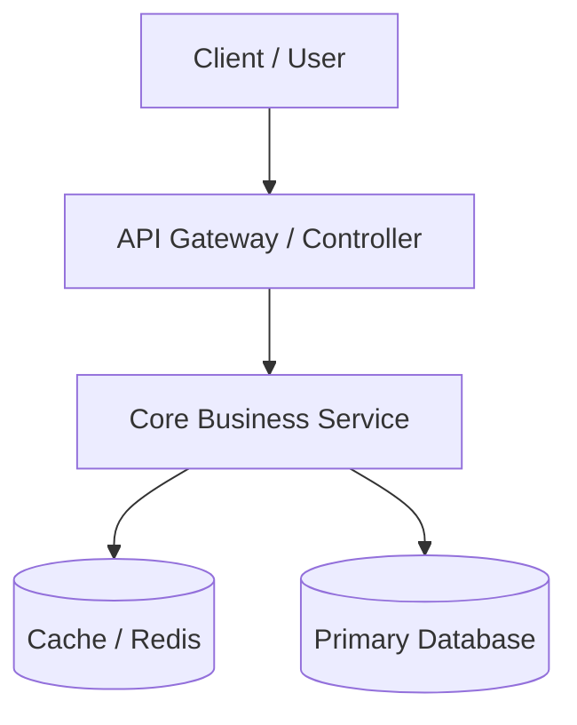

---
name: antigravity-planner
description: Creates professional, visually rich implementation plans matching Google Antigravity standards. Includes mandatory Mermaid architecture/flow diagrams, GFM alert callouts, component diff tables, and rigorous verification plans.
---

# Antigravity Plan Architect

When tasked with planning any software feature, refactor, architectural change, or system design, you MUST produce an implementation plan following this exact blueprint.

---

## 1. Visual & Structural Standards

- **Mandatory Mermaid Diagram:** Every plan MUST contain at least one visual architecture diagram, sequence diagram, or workflow chart using Mermaid (```mermaid).
  - Use `graph TD` for system architecture, component hierarchies, or data pipelines.
  - Use `sequenceDiagram` for API flows, authentication, or multi-step service interactions.
  - **Syntax Safety:** Always wrap node labels containing parentheses, brackets, or commas in double quotes: e.g., `id["Database (PostgreSQL)"]`.
- **Horizontal Isolation:** Separate major sections with `---` preceded and followed by blank lines for visual breathing room.
- **GFM Alert Callouts:** Never bury critical trade-offs or warnings in plain text:
  - Use `> [!IMPORTANT]` for non-negotiable architectural decisions.
  - Use `> [!WARNING]` for breaking changes or potential regressions.
  - Use `> [!NOTE]` for background prerequisites or edge-case context.
- **Component File Tagging:** Clearly demarcate every file change using:
  - `[NEW]` for files to create.
  - `[MODIFY]` for files being edited.
  - `[DELETE]` for files being removed.

---

## 2. Master Implementation Plan Blueprint

Whenever generating an `implementation_plan.md` artifact, structure it using this exact template:

```markdown
# Implementation Plan: [Feature / Architecture Name]

Brief 2-3 sentence overview of the goal, problem being solved, and target outcome.

---

## 1. System Architecture & Flow

Provide a clear Mermaid diagram illustrating the data flow, component layout, or interaction:



Key architectural considerations:
- Concise bullet 1 explaining the interaction flow.
- Concise bullet 2 highlighting performance or security boundaries.

---

## 2. User Review & Ripple Impact Analysis

> [!IMPORTANT]
> If implementing this change requires modifying any other existing function, feature, or component, explicitly disclose:
> 1. **What is currently there:** Exact current behavior and code snippet of the affected existing function.
> 2. **What intends to change:** Specific modifications planned for that existing logic.
> 3. **Why / For what:** The architectural justification explaining why the ripple change is necessary.

---

## 3. Open Questions

- [ ] Question 1: Ambiguity or preference that needs clarification (if any).
- [ ] Question 2: Environmental or configuration constraint.

---

## 4. Proposed Changes

Group changes logically by component, layer, or module:

### [Component / Layer Name]
#### [NEW] `path/to/new_file.ts`
- Purpose of the file.
- Key exported interfaces/classes.

#### [MODIFY] `path/to/existing_file.ts`
- Summary of additions/replacements.
- Mention specific functions or methods affected.

---

## 5. Verification & Testing Plan

### Automated Tests
```bash
# Run unit & integration tests
npm test
# Run linter
npm run lint
```

### Manual Verification Steps
- [ ] Step 1: Specific action to take (e.g., "Send POST request to /api/v1/auth").
- [ ] Step 2: Expected response or behavior (e.g., "Verify 200 OK and JWT cookie returned").
- [ ] Step 3: Edge case verification (e.g., "Send expired token and confirm 401 Unauthorized").
```
